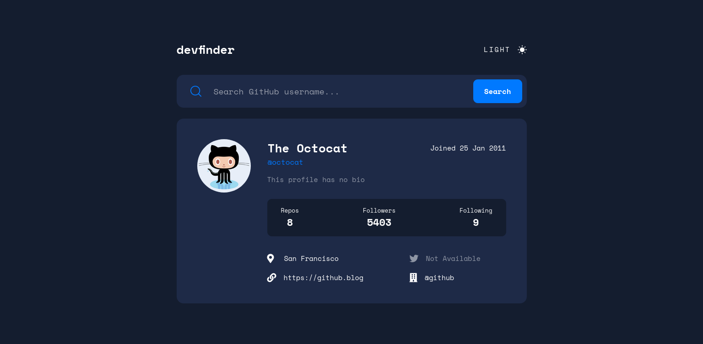

# devfinder

My solution to the **GitHub User Search App** challenge on [Frontend Mentor](https://www.frontendmentor.io/)

## Project Specifications

-  Search for GitHub users by their username
-  Fetch data from the [GitHub Users API](https://docs.github.com/en/rest/reference/users#get-a-user)
-  See relevant user information
-  Display a red message for invalid searches
-  Switch between light and dark themes

## Coded with

-  React
-  TypeScript
-  CSS

Live Site URL: https://fadiyousif.github.io/devfinder/

